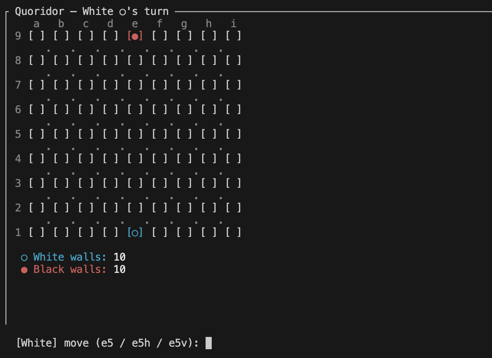

# Quoridor AI

A fully-playable terminal implementation of [Quoridor](https://en.wikipedia.org/wiki/Quoridor) with a suite of AI bots, written in Rust. Supports human-vs-human, human-vs-bot, and bot-vs-bot play, rendered in the terminal via `ratatui`. Slideshow linked here: [Google Slides](https://docs.google.com/presentation/d/12a-Bhgr4o9ashFwgKOv5B9sAN5-ewZYysqfUeKaKHSQ/edit?usp=sharing)

---

## Build & Run

```bash
# Human (white) vs alpha-beta depth 5 (default)
cargo run --release -- human ab5

# Human vs alpha-beta depth 7 with urgent evaluator
cargo run --release -- human ab7urgent

# Bot vs bot
cargo run --release -- ab5 ab7urgent

# Minimax vs parallelized alpha-beta
cargo run --release -- mm3base p5urgent
```

`--release` is strongly recommended for any AI opponent — it typically yields 10–100× faster search.

### Player Syntax

| Spec          | Description                                  |
| ------------- | -------------------------------------------- |
| `human`       | Interactive keyboard input                   |
| `random`      | Plays a random legal move each turn          |
| `mm<n>[eval]` | Minimax search to depth `n`                  |
| `ab<n>[eval]` | Alpha-beta pruning to depth `n`              |
| `p<n>[eval]`  | Parallelized alpha-beta (Rayon) to depth `n` |

**Depth** `n` is a positive integer. Odd depths are preferred (search ends on the bot's own ply). Higher depth = stronger play, but exponentially more expensive.

### Evaluator Suffix

Append directly after the depth (e.g. `ab5urgent`). Defaults to `simple` if omitted.

| Suffix   | Evaluator         | Formula                                                        |
| -------- | ----------------- | -------------------------------------------------------------- |
| `base`   | `BaseEvaluator`   | `black_dist − white_dist`                                      |
| `simple` | `SimpleEvaluator` | `10 × dist_diff + wall_diff + 5 × tempo`                       |
| `urgent` | `UrgentEvaluator` | Like `simple`, but wall weight varies with game urgency (0–10) |

### Controls (Human Player)

| Input | Action                             |
| ----- | ---------------------------------- |
| `e5`  | Move pawn to square e5             |
| `e5h` | Place horizontal wall at corner e5 |
| `e5v` | Place vertical wall at corner e5   |
| `Esc` | Quit                               |

### Endgame

Upon a player winning, you can press `Enter` to gracefully close the program.

Known bug: Sometimes the bots will choose not to win immediately and "flaunt" their win, unfortunately you may just have to kill that shell.

---

## Screenshots

### Gameplay (human vs bot)



White (○) moves up; Black (●) moves down. Walls are colored by the player who placed them.

### Win Screen


---

## Features & Implementation

### Bitboard Representation

The board is encoded entirely in three bitfields stored inline in a single `Board` struct:

```rust
struct Walls {
    walls_above: u128,  // bit i set ↔ there is a wall above square i
    walls_right: u128,  // bit i set ↔ there is a wall to the right of square i
    corners: u64,       // bit i set ↔ wall corner i is occupied
}

struct Board {
    walls: Walls,
    white: PlayerStatus,  // position_idx: u8, walls_remaining: u8
    black: PlayerStatus,
}
```

The entire `Board` is 46 bytes — fits in one cache line. The search passes it by mutable reference (`&mut Board`) through recursion, using `make_move`/`unmake_move` to avoid any per-node allocation. The parallel bot copies it once per thread so each worker has an independent board to mutate.

Walls are two squares wide; a horizontal wall placed at corner `c` sets bits `c` and `c+1` in `walls_above`, and the corresponding corner bit prevents overlapping placements. Wall checks in the move generator are single bitwise AND operations marked `#[inline(always)]`.

### Bitwise BFS

Path validation (legal wall placement) and distance computation both use a bitboard flood-fill that expands all reachable squares in parallel per iteration:

```rust
let next_left  = ((frontier & !COL0_MASK) >> 1) & !walls_right;
let next_right = ((frontier & !COL8_MASK) << 1) & !(walls_right << 1);
let next_up    = (frontier << 9) & !(walls_above << 9);
let next_down  = (frontier >> 9) & !walls_above;
frontier = (next_left | next_right | next_up | next_down) & ALL_MASK;
```

Each BFS step processes all reachable squares at the current distance in a handful of arithmetic instructions, making wall-placement validation fast enough to run inside the search tree.

### Stack-Allocated Move Lists with `arrayvec`

A naive implementation allocates a `Vec` for legal moves on every node of the search tree — potentially millions of heap allocations per second. Instead, move generation fills a fixed-capacity `ArrayVec<Move, 133>` (at most 5 pawn moves + 128 wall candidates) that lives entirely on the stack:

```rust
pub(crate) fn get_available_candidate_moves(&self, is_white_turn: bool)
    -> ArrayVec<Move, 133>
```

This eliminates the allocator entirely from the hot path and improves cache locality.

### `Player` and `Evaluator` Traits

All bot types implement the `Player` trait:

```rust
pub trait Player {
    fn get_move(&mut self, board: &Board, is_white: bool) -> Move;
}
```

and all evaluation functions implement `Evaluator`:

```rust
pub(crate) trait Evaluator {
    fn eval(&self, board: &Board, is_white_turn: bool) -> i32;
}
```

Bots are generic over `E: Evaluator` (monomorphized at compile time for zero-cost dispatch in the hot path) while the top-level `main` uses `Box<dyn Player>` for runtime flexibility. This lets the three evaluators — `BaseEvaluator`, `SimpleEvaluator`, `UrgentEvaluator` — be swapped in via command-line argument without any runtime branching inside the search loop. The _tempo_ term in `SimpleEvaluator` and `UrgentEvaluator` (`+5` for white to move, `−5` for black) breaks symmetry so the engine prefers to be the one moving when the position is equal.

### Alpha-Beta Pruning

The `AlphaBetaBot` extends minimax with alpha-beta cutoffs, pruning subtrees that cannot affect the final result:

```rust
if beta <= alpha { break; }
```

Alpha-beta prunes on average the square root of minimax's nodes, making depth-5 search feasible in real time.

### Parallelized Alpha-Beta with `rayon` and Atomics

`ParallelAlphaBetaBot` parallelizes the root's move list with Rayon's parallel iterators. Because alpha-beta's global bounds (`alpha`, `beta`) must be shared across threads, they are stored as `AtomicI32` with `Ordering::Relaxed` loads/stores — sufficient for opportunistic pruning without introducing synchronization overhead:

```rust
let shared_alpha = AtomicI32::new(i32::MIN);
let shared_beta  = AtomicI32::new(i32::MAX);

pawn_moves.par_iter().filter_map(|&mv| {
    search_root_move(mv, board, is_white, this, &shared_alpha, &shared_beta)
}).collect()
```

Pawn moves are dispatched first (they are almost always best) to tighten bounds before the wall moves begin, improving pruning in the wall phase. Each worker thread clones the `Board` locally and runs a sequential alpha-beta subtree, consulting the shared bounds at the root of each subtree.

### Terminal UI (`ratatui` + `crossterm`)

The board and walls are rendered using `ratatui`'s `Paragraph` widget, constructing styled `Span` sequences for each cell, wall segment, and corner post. Player-owned walls are color-coded (cyan for white, red for black). `crossterm` drives raw-mode input for the human player: each keypress is read individually, validated, and reflected in the prompt before submission.

---

## Benchmark Results

Run the benchmark yourself:

```bash
cargo test --release bench::compare -- --nocapture
```

This tests three positions (after white e2, e3, e4) at increasing depths, comparing minimax, alpha-beta, and parallelized alpha-beta.

### Minimax vs Alpha-Beta vs Parallel Alpha-Beta

```
-- after white e2 (black to move) --
depth    minimax (ms) alpha-beta (ms)    par-ab (ms)      mm/ab     ab/par
---------------------------------------------------------------------------
1                0.01            0.01           0.28       1.0x       0.0x
2                2.92            0.16           0.36      17.9x       0.5x
3              186.54            1.47           0.43     126.8x       3.4x
4            22782.49            7.66           4.00    2975.8x       1.9x
5           (skipped)          182.27          39.52          -       4.6x
6           (skipped)       (skipped)         616.98          -          -
7           (skipped)       (skipped)        7285.82          -          -

-- after white e3 (black to move) --
depth    minimax (ms) alpha-beta (ms)    par-ab (ms)      mm/ab     ab/par
---------------------------------------------------------------------------
1                0.01            0.01           0.23       1.0x       0.0x
2                1.31            0.06           0.31      22.8x       0.2x
3              158.57            1.30           0.67     121.9x       2.0x
4            19404.30            8.42           3.32    2304.9x       2.5x
5           (skipped)          164.12          33.35          -       4.9x
6           (skipped)       (skipped)         587.40          -          -
7           (skipped)       (skipped)       15835.83          -          -

-- after white e4 (black to move) --
depth    minimax (ms) alpha-beta (ms)    par-ab (ms)      mm/ab     ab/par
---------------------------------------------------------------------------
1                0.01            0.01           0.19       1.0x       0.1x
2                1.05            0.05           0.16      20.0x       0.3x
3              135.30            1.08           0.43     125.5x       2.5x
4            16755.64            9.99           6.77    1677.1x       1.5x
5           (skipped)          202.80          40.13          -       5.1x
6           (skipped)       (skipped)         659.44          -          -
7           (skipped)       (skipped)       22238.62          -          -
```

**Key takeaways:**

- Alpha-beta is roughly **1700–3000× faster** than minimax at depth 4, confirming near-optimal pruning for this game.
- Parallelized alpha-beta is **2–5× faster** than single-threaded alpha-beta at depths 3–5. At shallow depths, thread-spawn overhead dominates; the speedup compounds at higher depths where the subtrees are large enough to benefit from parallelism.
- Parallel alpha-beta reaches **depth 7** in reasonable time (~7–22 s), which is inaccessible to single-threaded alpha-beta and completely out of reach for minimax.

---

## Crates Used

| Crate       | Purpose                                                             |
| ----------- | ------------------------------------------------------------------- |
| `ratatui`   | Terminal UI framework — renders the board, walls, and win screen    |
| `crossterm` | Cross-platform raw-mode terminal input/output                       |
| `rayon`     | Work-stealing thread pool for parallelized alpha-beta search        |
| `arrayvec`  | Stack-allocated fixed-capacity vector for heap-free move generation |
| `rand`      | Random number generation for `RandomBot`                            |

---

## Rust Features Used

- **Traits with generics** — `AlphaBetaBot<E: Evaluator>` is monomorphized per evaluator; `Box<dyn Player>` provides runtime polymorphism at the top level.
- **`&mut` with make/unmake** — the recursive search passes `Board` by mutable reference and undoes moves rather than allocating per node; `Board: Copy` lets the parallel bot hand each thread its own copy with zero heap allocation.
- **`u128` bitboards** — non-standard integer width used to pack the full 81-square board into a single register-width integer, enabling SIMD-like parallel wall checks.
- **`AtomicI32` + `Ordering::Relaxed`** — lock-free shared alpha/beta bounds across Rayon threads without synchronization barriers.
- **`#[inline(always)]`** — aggressive inlining on wall-check and move-generation hot paths.
